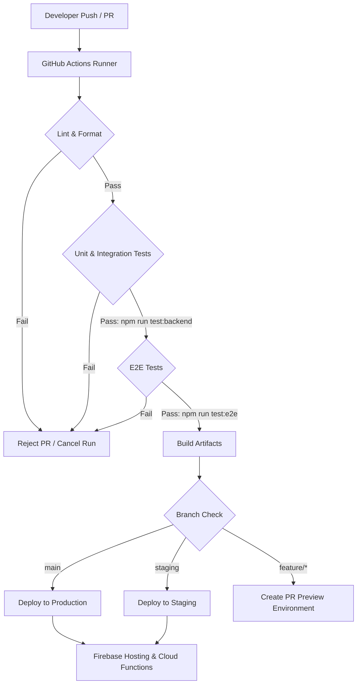

# Podea Deployment & Launch Plan

This document details the CI/CD architecture, environment strategies, monitoring, analytics integrations, feature flagging mechanism, and pilot rollout plan for the Podea platform.

---

## 1. CI/CD & Deployment Workflow

Podea uses a Git-flow based automated CI/CD pipeline integrated with GitHub Actions and Firebase CLI to guarantee linting, testing, and secure builds before deployment.

### A. Deployment Pipeline Architecture



### B. CI/CD Configuration Spec (`.github/workflows/deploy.yml`)

The deployment environment utilizes GitHub Actions to execute parallel build steps. The configuration below ensures that Firestore Security Rules are tested and secrets are securely injected at build time.

| Step | Commands | Runner OS | Secrets Required |
| :--- | :--- | :--- | :--- |
| **Lint & Format** | `npm run lint` / `npx prettier --check .` | Ubuntu Latest | None |
| **Backend Tests** | `npm run test:backend` | Ubuntu Latest | None (Uses Local Firebase Emulator) |
| **E2E Tests** | `npm run test:e2e` | Ubuntu Latest | None (Uses Local Playwright Emulator) |
| **Firebase Staging Deploy** | `firebase deploy --only hosting,functions --project staging` | Ubuntu Latest | `FIREBASE_CLI_TOKEN_STAGING`, `STRIPE_WEBHOOK_SECRET_STAGING` |
| **Firebase Production Deploy** | `firebase deploy --only hosting,functions --project production` | Ubuntu Latest | `FIREBASE_CLI_TOKEN_PROD`, `STRIPE_WEBHOOK_SECRET_PROD` |

> [!IMPORTANT]
> To prevent deployment drift, Firestore security rules (`firestore.rules`) and index specifications (`firestore.indexes.json`) are version-controlled and deployed automatically along with application hosting and functions config.

---

## 2. Environment Strategy

To isolate developer changes, QA test validations, and live customer data, Podea defines three distinct deployment environments.

```
       [ Local Development ]
                 │
                 ▼ (Pull Request Merge)
         [ Staging (QA) ]
                 │
                 ▼ (Release Tag / Approval)
       [ Production (Live) ]
```

### A. Environment Matrix

| Parameter | Local Development | Staging (QA) | Production (Live) |
| :--- | :--- | :--- | :--- |
| **Firebase Project** | `podea-dev` / Local Emulator | `podea-staging-12a83` | `podea-prod-3b91c` |
| **Firestore Database** | Emulator / Local Database | Staging Database Instance | Production Multi-Region Instance |
| **Authentication** | Emulator / Mock Users | Staging Auth (Test Emails) | Production Auth (Strict Providers) |
| **Secrets Engine** | `.env.local` (Git ignored) | GCP Secret Manager (Staging) | GCP Secret Manager (Prod) |
| **Payment Provider** | Stripe Test Mode | Stripe Test Mode | Stripe Live Mode |
| **SMS/Calendar APIs** | Twilio Sandbox | Twilio Sandbox | Twilio Production Accounts |

### B. Configuration and Secret Resolution
All third-party credentials (API keys, webhook secrets, and private keys) are resolved at runtime in Cloud Functions using GCP Secret Manager:

```typescript
import { defineSecret } from 'firebase-functions/params';

// Secret declarations (bound dynamically inside GCP console or via Terraform)
export const stripeSecretKey = defineSecret('STRIPE_SECRET_KEY');
export const twilioAuthToken = defineSecret('TWILIO_AUTH_TOKEN');
```

> [!CAUTION]
> Never hardcode API keys or credentials directly into settings files, environment config files, or JavaScript modules. Local execution must always pull from git-ignored `.env.local` templates.

---

## 3. Monitoring & Alerting Plan

Reliability is critical for medical clinic kiosk check-ins and practitioner workflows. The system establishes comprehensive observability.

### A. Infrastructure Monitoring

* **Cloud Functions Error Reporting:** Auto-integrates with Google Cloud Error Reporting. Alerts are triggered on any unhandled exceptions in the Node.js functions runtime.
* **Firestore Execution Metrics:** CPU usage, read/write operation rates, and active connections are tracked via Google Cloud Monitoring dashboard.
* **Frontend Performance:** Sentry is integrated into the Vite react client bundle to capture client-side uncaught routing/rendering exceptions.

### B. Alerting Rules & Severity Matrix

Alerts are sent to team channels (Slack/Discord Webhooks) based on severity:

| Metric | Threshold | Severity | Immediate Action |
| :--- | :--- | :--- | :--- |
| **Cloud Function Success Rate** | `< 99.5%` for 5 mins | Critical | PagerDuty trigger, automatically rollback last functions deployment. |
| **Function Latency (p95)** | `> 2500ms` | Warning | Developers alerted to inspect database indices and cold start optimizations. |
| **Firestore Query Index Errors**| `> 0` errors | Critical | Promptly generate missing indices from the console log link and patch `firestore.indexes.json`. |
| **E2E Auth Failure Rate** | `> 2%` user sign-in errors | Critical | Lock active checkout/registration pipeline and notify infrastructure team. |

---

## 4. Analytics & Conversion Tracking

To track the effectiveness of the **Upsell & Recommendation Engine** (refer to [metrics.md](file:///c:/Users/dayoo/OneDrive/Dokumente/development/Podea/metrics.md)), the client-side UI logs custom user-action events.

### A. Analytics Pipeline

```
[ Client Kiosk / Portal UI ] ──(Events)──> [ Firebase Analytics ]
                                                   │
                                                   ▼ (Export Stream)
                                           [ BigQuery (SQL Analysis) ]
```

### B. Event Logging Schema

| Event Name | Trigger Context | Custom Parameters | Analytical Purpose |
| :--- | :--- | :--- | :--- |
| `upsell_pitched` | An upsell card is rendered to the user on kiosk or practitioner workspace. | `addonId`, `ruleId`, `price`, `studioId` | Tracks raw exposure rate ($O_{rate}$) of add-on products. |
| `upsell_accepted` | Practitioner/Client accepts the upsell card recommendation. | `addonId`, `ruleId`, `price`, `studioId` | Measures upsell conversion efficiency ($Conversion_{rate}$). |
| `upsell_declined` | User clicks "No, thanks" or dismisses the upsell component. | `addonId`, `ruleId`, `reason` (if provided) | Identifies friction points or disliked recommendation types. |
| `kiosk_checkin_completed`| Guest completes the onboarding form and checks in. | `timeToComplete`, `isNewClient`, `studioId` | Monitors guest funnel and friction in the kiosk UI. |

---

## 5. Feature Flags Specification

Feature flags decouple code deployment from feature enablement, facilitating safe testing and canary releases.

### A. Implementation via Firebase Remote Config
Feature flags are managed using Firebase Remote Config with local caching:

1. **Practitioner Feature Flags:**
   * `enable_advanced_charting`: Boolean. Activates drawing canvases and photo uploads in the clinical treatment editor.
   * `kiosk_upsell_rules_engine`: Boolean. Enables/disables the smart rules engine on the kiosk tablet display.
2. **Global Rollout Flags:**
   * `stripe_billing_active`: Boolean. Controls whether users are redirected to real checkout pipelines vs draft setups.

### B. Local Hook Code Example (`useFeatureFlag.ts`)

```typescript
import { useState, useEffect } from 'react';
import { getRemoteConfig, getValue, fetchAndActivate } from 'firebase/remote-config';

export function useFeatureFlag(flagKey: string, defaultValue: boolean = false): boolean {
  const [enabled, setEnabled] = useState(defaultValue);

  useEffect(() => {
    const config = getRemoteConfig();
    config.settings.minimumFetchIntervalMillis = 3600000; // 1-hour cache

    fetchAndActivate(config)
      .then(() => {
        const value = getValue(config, flagKey).asBoolean();
        setEnabled(value);
      })
      .catch(() => {
        // Fallback to default in case of network issues
        setEnabled(defaultValue);
      });
  }, [flagKey, defaultValue]);

  return enabled;
}
```

---

## 6. Pilot Rollout & Launch Strategy

The launch strategy minimizes operational risk through a tiered rollout structure.

### A. Rollout Phases

```
┌────────────────────────────────────────────────────────┐
│ Phase 1: Internal Dry-Run (Dogfooding)                  │
│ Target: Internal QA & Dev Team                         │
│ Duration: 1 Week                                       │
└──────────────────────────┬─────────────────────────────┘
                           │
                           ▼
┌────────────────────────────────────────────────────────┐
│ Phase 2: Single-Studio Pilot                           │
│ Target: 1 Selected Partner Studio (Low-traffic)        │
│ Duration: 2 Weeks                                      │
└──────────────────────────┬─────────────────────────────┘
                           │
                           ▼
┌────────────────────────────────────────────────────────┐
│ Phase 3: Regional Multi-Studio Rollout                 │
│ Target: 5 - 10 Selected Studios                        │
│ Duration: 2 Weeks                                      │
└──────────────────────────┬─────────────────────────────┘
                           │
                           ▼
┌────────────────────────────────────────────────────────┐
│ Phase 4: General Availability (GA)                     │
│ Target: 100% of studios                                │
└────────────────────────────────────────────────────────┘
```

### B. Pilot Validation Criteria (Gate checks)
Before promoting from one phase to the next, the platform must satisfy the following metrics:
- **Zero Contraindication Errors:** 100% accuracy in safety and risk filtering during guest check-in (verified by audit logs).
- **Kiosk Session Success:** > 98% of kiosk check-ins completed without application exceptions or page refreshes.
- **Conversion Tracking Cleanliness:** Upsell logs matches actual Stripe billing lines with 100% correlation.

---

## 7. Production Launch Checklist

Follow this checklist sequentially during the launch window.

### Pre-Launch Preparation
- [ ] **DNS & SSL Setup**: Bind production domains to Firebase Hosting. Validate SSL activation.
- [ ] **Authentication Domain Whitelisting**: Add production domains to authorized OAuth domains in Firebase console.
- [ ] **Database Rules Audit**: Run `npm run test:backend` locally. Deploy latest rules via `firebase deploy --only firestore:rules`.
- [ ] **Firestore Index Deployment**: Validate custom index deployments by verifying all fields in `firestore.indexes.json` match current console indexes.
- [ ] **GCP Secrets Configured**: Verify production values for Stripe webhook keys, Twilio API tokens, and Lexoffice secrets are securely populated in Cloud Secret Manager.

### Deployment Phase
- [ ] **Cloud Functions Deploy**: Run `firebase deploy --only functions` from production branch.
- [ ] **Web Build & Upload**: Execute Vite build pipeline and deploy static bundle to Firebase Hosting.
- [ ] **Stripe Webhook Registration**: Add the production cloud function URL (e.g. `https://us-central1-podea-prod.cloudfunctions.net/stripeWebhook`) to the Stripe Developer dashboard. Subscribe to `checkout.session.completed` events.

### Post-Launch & Verification
- [ ] **Smoke Test - Kiosk Flow**: Access Kiosk UI, create test onboarding draft, verify record correctly inserts into `onboarding_drafts` Firestore collection.
- [ ] **Smoke Test - Practitioner Workflow**: Log in as a practitioner, search the test check-in, draft treatment note, and complete a test transaction.
- [ ] **Monitoring Verification**: Open Cloud Logging dashboard. Ensure there are no database queries triggering missing-index errors or unhandled webhook errors.
