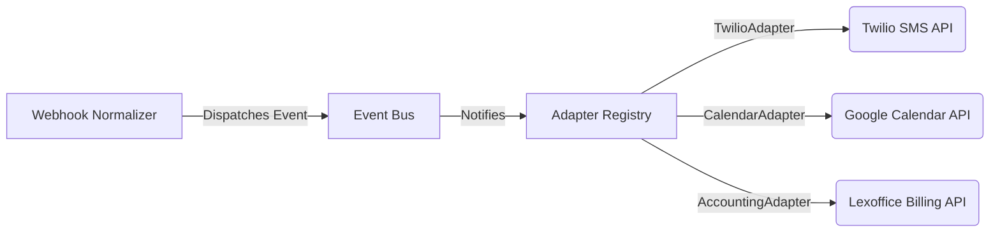
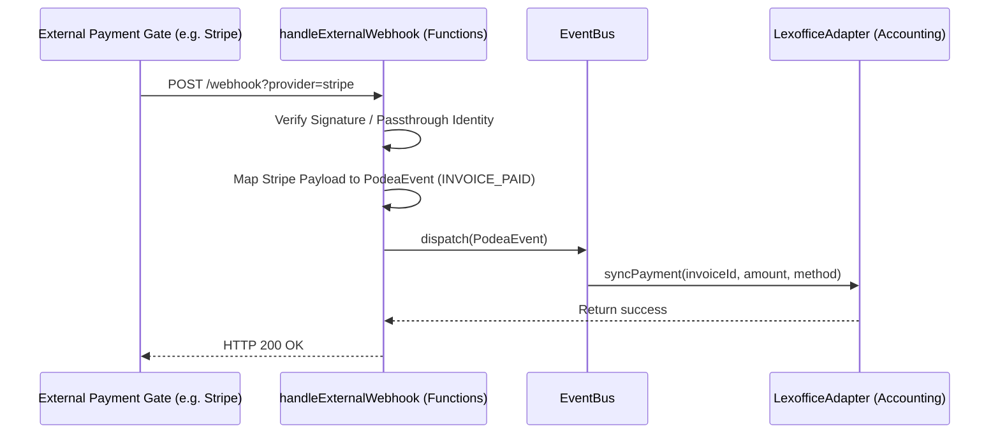

# Podea Integration Architecture & Adapter Specifications

This document defines Podea's integration architecture, detailing the Event-Driven System, Webhook Normalization Layer, and External Integration Adapters.

---

## 1. System Topology Overview

Podea uses an event-driven bridge designed around the **Adapter Pattern** to isolate core business rules from external third-party APIs (Google Calendar, Twilio, Lexoffice). 



---

## 2. Event System & Message Schema

The communication backbone of Podea relies on a structured, serializable event model (`PodeaEvent`).

### The Event Model (`PodeaEvent<T>`)

```typescript
export interface PodeaEvent<T = any> {
  id: string;          // Unique UUID for message deduplication
  type: string;        // Domain event descriptor, e.g. 'APPOINTMENT_CREATED'
  studioId: string;    // Multi-tenant boundary identifier
  timestamp: Date;     // Timestamp of event creation
  payload: T;          // Typed schema payload
}
```

### Supported Event Types

| Event Type | Payload Details | Action Triggered |
| :--- | :--- | :--- |
| `APPOINTMENT_CREATED` | clientName, phone, service, startTime, endTime | SMS reminder queue, Google Calendar sync |
| `INVOICE_GENERATED` | invoiceId, clientId, amount, items, vatRate | Lexoffice document creation |
| `INVOICE_PAID` | invoiceId, paymentMethod, amountPaid | Payment confirmation SMS, accounting reconciliation |

---

## 3. Webhook Normalization Layer

External webhook payloads are parsed, verified, and mapped into internal standard `PodeaEvent` structures using specific adapters.

### Webhook Flow Diagram



---

## 4. Example Adapters (The Adapter Pattern)

The `IntegrationAdapter` abstract base class isolates third-party API configurations:

```typescript
export abstract class IntegrationAdapter {
  protected studioId: string;
  protected config: IntegrationConfig;

  constructor(config: IntegrationConfig) {
    this.studioId = config.studioId;
    this.config = config;
  }

  abstract initialize(): Promise<boolean>;
  abstract get providerName(): string;
}
```

### A. TwilioAdapter (SMS API)
Integrates Twilio SMS APIs using active configurations. Validates phone formatting and handles client reminders.

### B. GoogleCalendarAdapter (Calendar API)
Synchronizes appointment structures into external calendar entries. Handles OAuth flow validation.

### C. LexofficeAdapter (Accounting API)
Pushes itemized sales structures into Lexoffice ledger books. Normalizes VAT tax categories for European compliance rules.
