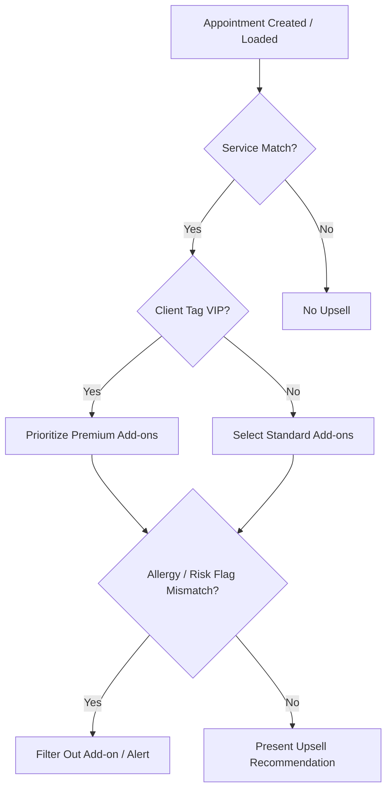

# Podea Metrics & Upsell Engine Specification

This document details the logic, calculations, schemas, and rule-based constraints powering the Podea Dashboard and Revenue/Upsell Intelligence modules.

---

## 1. Metrics Structure & Calculations

The Dashboard aggregates metrics in real-time by joining Firestore collections. Below are the formulas and structures used.

### A. Core Metrics

#### 1. Daily Base Service Revenue ($R_{base}$)
Sum of all completed appointments' base service prices for the current calendar day.
$$R_{base} = \sum_{a \in A_{completed}} Price(Service_a)$$
Where:
- $A_{completed}$ is the set of appointments scheduled today with `status == 'completed'`.
- $Service_a$ is the service linked to appointment $a$.

#### 2. Daily Upsell Revenue ($R_{upsell}$)
Sum of all prices of accepted/completed add-ons during today's sessions.
$$R_{upsell} = \sum_{a \in A_{completed}} \left( \sum_{addon \in Addons_a} Price(addon) \right)$$

#### 3. Total Daily Revenue ($R_{total}$)
Total daily intake combining services and successful upsell add-ons.
$$R_{total} = R_{base} + R_{upsell}$$

#### 4. Estimated Month Revenue ($R_{month}$)
Monthly projection modeled naively based on today's performance extrapolated across a standard 20-day business month.
$$R_{month} = R_{total} \times 20$$

#### 5. Appointment Completion Rate ($C_{rate}$)
Percentage of scheduled appointments today that reached a `completed` status.
$$C_{rate} = \left( \frac{|A_{completed}|}{|A_{total}|} \right) \times 100$$
Where:
- $A_{total}$ is the set of all appointments today (excluding cancelled ones).

---

### B. Upsell Conversion Metrics

#### 1. Pitch Opportunity Rate ($O_{rate}$)
Total pitches offered to expected or checked-in arrivals today.
$$O_{rate} = |P_{pitched}| + |P_{pending}|$$

#### 2. Upsell Conversion Rate ($Conversion_{rate}$)
Ratio of accepted pitches compared to total pitches pitched to clients today.
$$Conversion_{rate} = \left( \frac{|P_{accepted}|}{|P_{pitched}|} \right) \times 100$$
Where:
- $P_{accepted}$ are pitched upgrades accepted by practitioners/clients.
- $P_{pitched}$ is the total number of pitches attempted today.

#### 3. Maximum Potential Revenue ($R_{potential}$)
Theoretical maximum revenue if 100% of today's upsell recommendations were accepted.
$$R_{potential} = R_{total} + \sum_{o \in Opportunities_{pending}} Price(Addon_o)$$

---

## 2. Rule-Based Upsell Engine Logic

The engine selects add-ons to recommend based on a multi-criteria scoring and filtering pipeline:

### Criteria Evaluation

1. **Trigger Service Matching**: Checks if the appointment's `serviceId` matches any active `UpsellRule.triggerServiceIds`.
2. **Client Tag Targeting**:
   - If the client tag contains `vip`, recommend premium add-ons first (add-ons with higher prices).
3. **Medical Safety / Risk Flag Filtering**:
   - If a client has a `RiskFlag` with type `medical_condition` or `allergy` that restricts specific substances (e.g., "allergy: lavender" or "retinol warning"), the engine automatically scans `AddOn.description` or tags and **excludes** matches to prevent contraindications.
4. **Availability check**: Ensures that the selected add-on or retail product is currently in-stock (`Product.stockLevel > 0` or active status).
